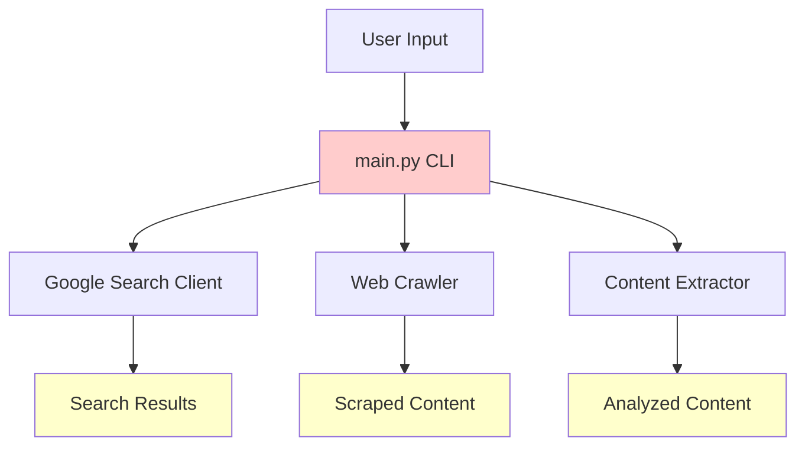
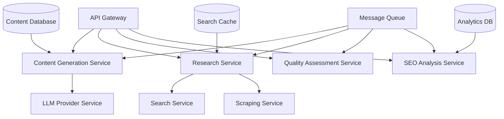

# Architecture Improvement Ideas

## 🏗️ Architecture Enhancement Proposal
**What architectural improvements are you suggesting?**

## 📐 Current Architecture Analysis

### Current System Design


### Current Architecture Strengths
- Simple, monolithic design
- Clear separation of concerns in modules
- Minimal dependencies
- Easy to understand and debug

### Current Architecture Limitations
- **Tight coupling:** Direct dependencies between modules
- **Synchronous processing:** Blocking operations limit throughput
- **No persistence layer:** Stateless, no data retention
- **Limited scalability:** Single-threaded, single-instance
- **No error resilience:** No retry mechanisms or circuit breakers
- **Minimal observability:** Basic logging only

## 🎯 Proposed Architecture Improvements

### 1. Microservices Architecture
**Current:** Monolithic application
**Proposed:** Service-oriented architecture



### 2. Event-Driven Architecture
**Current:** Direct method calls
**Proposed:** Event-driven with message queues

```python
# Event-driven content generation pipeline
from fastapi import FastAPI
from celery import Celery
import asyncio

# Event publisher
async def publish_content_request(keyword: str, settings: dict):
    event = ContentGenerationEvent(
        keyword=keyword,
        settings=settings,
        timestamp=datetime.utcnow()
    )
    await event_bus.publish("content.generation.requested", event)

# Event handlers
@event_handler("content.generation.requested")
async def handle_content_generation(event: ContentGenerationEvent):
    # Trigger research phase
    await publish_research_request(event.keyword)
    
@event_handler("research.completed")
async def handle_research_completed(event: ResearchCompletedEvent):
    # Trigger content generation
    await publish_llm_generation_request(event.research_data)
```

### 3. Hexagonal Architecture (Ports & Adapters)
**Current:** Direct dependencies
**Proposed:** Dependency inversion with interfaces

```python
# Domain layer
class ContentGenerator:
    def __init__(self, 
                 search_port: SearchPort,
                 llm_port: LLMPort,
                 storage_port: StoragePort):
        self.search_port = search_port
        self.llm_port = llm_port
        self.storage_port = storage_port

# Ports (interfaces)
class SearchPort(ABC):
    @abstractmethod
    async def search_keyword(self, keyword: str) -> SearchResult: ...

class LLMPort(ABC):
    @abstractmethod
    async def generate_content(self, prompt: str) -> ContentResult: ...

# Adapters (implementations)
class GoogleSearchAdapter(SearchPort):
    async def search_keyword(self, keyword: str) -> SearchResult:
        # Google-specific implementation

class GroqLLMAdapter(LLMPort):
    async def generate_content(self, prompt: str) -> ContentResult:
        # Groq-specific implementation
```

### 4. CQRS (Command Query Responsibility Segregation)
**Current:** Mixed read/write operations
**Proposed:** Separate command and query models

```python
# Command side (writes)
class CreateContentCommand:
    keyword: str
    settings: ContentSettings
    user_id: str

class ContentCommandHandler:
    async def handle(self, command: CreateContentCommand):
        # Handle content creation business logic
        pass

# Query side (reads)
class ContentQuery:
    content_id: str
    include_analytics: bool

class ContentQueryHandler:
    async def handle(self, query: ContentQuery) -> ContentView:
        # Optimized read model
        return await self.read_store.get_content_view(query.content_id)
```

## 🚀 Scalability Improvements

### 1. Horizontal Scaling Design
```yaml
# Kubernetes deployment example
apiVersion: apps/v1
kind: Deployment
metadata:
  name: content-generator
spec:
  replicas: 5
  selector:
    matchLabels:
      app: content-generator
  template:
    spec:
      containers:
      - name: content-generator
        image: optiblogai/content-generator:latest
        resources:
          requests:
            memory: "512Mi"
            cpu: "250m"
          limits:
            memory: "1Gi"
            cpu: "500m"
```

### 2. Load Balancing Strategy
```python
# Intelligent load balancing for LLM providers
class LLMLoadBalancer:
    def __init__(self):
        self.providers = [
            GroqProvider(weight=0.7, rate_limit=100),
            GeminiProvider(weight=0.3, rate_limit=60),
        ]
    
    async def get_optimal_provider(self, request_type: str):
        # Route based on availability, cost, and performance
        for provider in self.providers:
            if await provider.can_handle_request():
                return provider
        
        # Fallback to queue if all providers busy
        await self.queue_request(request_type)
```

### 3. Caching Architecture
```python
# Multi-level caching strategy
class CacheManager:
    def __init__(self):
        self.l1_cache = InMemoryCache()  # Fast, small
        self.l2_cache = RedisCache()     # Medium speed, larger
        self.l3_cache = DatabaseCache()  # Slow, persistent
    
    async def get_content(self, cache_key: str):
        # Try L1 first
        if content := await self.l1_cache.get(cache_key):
            return content
            
        # Try L2
        if content := await self.l2_cache.get(cache_key):
            await self.l1_cache.set(cache_key, content)
            return content
            
        # Try L3
        if content := await self.l3_cache.get(cache_key):
            await self.l2_cache.set(cache_key, content)
            await self.l1_cache.set(cache_key, content)
            return content
            
        return None
```

## 🔒 Resilience & Reliability Patterns

### 1. Circuit Breaker Pattern
```python
class CircuitBreaker:
    def __init__(self, failure_threshold=5, timeout=60):
        self.failure_threshold = failure_threshold
        self.timeout = timeout
        self.failure_count = 0
        self.last_failure_time = None
        self.state = "CLOSED"  # CLOSED, OPEN, HALF_OPEN
    
    async def call(self, func, *args, **kwargs):
        if self.state == "OPEN":
            if time.time() - self.last_failure_time > self.timeout:
                self.state = "HALF_OPEN"
            else:
                raise CircuitBreakerOpenError()
        
        try:
            result = await func(*args, **kwargs)
            self.reset()
            return result
        except Exception as e:
            self.record_failure()
            raise e
```

### 2. Retry with Exponential Backoff
```python
import asyncio
from tenacity import retry, stop_after_attempt, wait_exponential

class LLMService:
    @retry(
        stop=stop_after_attempt(3),
        wait=wait_exponential(multiplier=1, min=4, max=10)
    )
    async def generate_content(self, prompt: str):
        try:
            return await self.llm_client.generate(prompt)
        except RateLimitError:
            # Exponential backoff will handle this
            raise
        except PermanentError:
            # Don't retry permanent errors
            raise
```

### 3. Bulkhead Pattern
```python
# Isolate different workloads
class ResourcePool:
    def __init__(self):
        self.search_pool = asyncio.Semaphore(10)  # Max 10 concurrent searches
        self.llm_pool = asyncio.Semaphore(5)      # Max 5 concurrent LLM calls
        self.scraping_pool = asyncio.Semaphore(20) # Max 20 concurrent scrapes
    
    async def execute_search(self, search_func):
        async with self.search_pool:
            return await search_func()
    
    async def execute_llm_call(self, llm_func):
        async with self.llm_pool:
            return await llm_func()
```

## 📊 Data Architecture Improvements

### 1. Event Sourcing
```python
# Store events, not just current state
class ContentGenerationEvent:
    timestamp: datetime
    event_type: str
    aggregate_id: str
    event_data: dict
    version: int

class EventStore:
    async def append_event(self, event: ContentGenerationEvent):
        # Store event in append-only log
        await self.storage.append(event)
    
    async def get_events(self, aggregate_id: str) -> List[ContentGenerationEvent]:
        # Replay events to rebuild state
        return await self.storage.get_events_for_aggregate(aggregate_id)
```

### 2. Read Models for Performance
```python
# Optimized read models
class ContentAnalytics:
    content_id: str
    total_views: int
    avg_rating: float
    seo_score: int
    last_updated: datetime

class AnalyticsProjection:
    async def handle_content_viewed(self, event: ContentViewedEvent):
        # Update read model for fast queries
        await self.update_view_count(event.content_id)
    
    async def handle_content_rated(self, event: ContentRatedEvent):
        await self.update_rating(event.content_id, event.rating)
```

## 🎯 Implementation Strategy

### Phase 1: Core Architecture (4-6 weeks)
- [ ] Implement hexagonal architecture with ports/adapters
- [ ] Add event-driven communication between modules
- [ ] Set up message queue infrastructure (Redis/RabbitMQ)
- [ ] Implement circuit breaker and retry patterns

### Phase 2: Scalability (3-4 weeks)
- [ ] Add horizontal scaling capabilities
- [ ] Implement load balancing for LLM providers
- [ ] Set up multi-level caching
- [ ] Add resource pools and bulkhead patterns

### Phase 3: Data Architecture (2-3 weeks)
- [ ] Implement event sourcing for audit trail
- [ ] Add CQRS for read/write separation
- [ ] Create optimized read models
- [ ] Set up data consistency patterns

### Phase 4: Observability (1-2 weeks)
- [ ] Add distributed tracing
- [ ] Implement metrics collection
- [ ] Set up monitoring dashboards
- [ ] Create alerting and SLA monitoring

## 📈 Expected Benefits

### Performance Improvements
- **Throughput:** 10-50x increase with async and parallel processing
- **Latency:** Reduced response times with caching and load balancing
- **Resource efficiency:** Better CPU and memory utilization

### Reliability Improvements
- **Fault tolerance:** Circuit breakers prevent cascade failures
- **Self-healing:** Automatic retry and recovery mechanisms
- **Data consistency:** Event sourcing provides audit trail

### Maintainability Improvements
- **Modularity:** Clear boundaries between services
- **Testability:** Isolated components easier to test
- **Flexibility:** Easy to swap implementations

---
*🏗️ **Architecture Tip**: Good architecture enables the system to evolve and scale gracefully!*