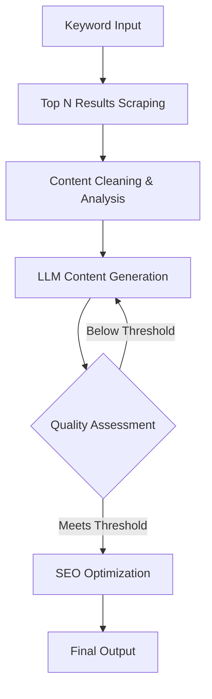

# OptiBlogAi: AI-Powered SEO Content Generator

[](https://opensource.org/licenses/MIT)
[](https://www.python.org/)
[](https://github.com/psf/black)

## Overview

OptiBlogAi is an open-source AI system that generates high-quality, SEO-optimized blog content through a multi-phase content production pipeline. By scraping top-ranking content, generating original articles with LLMs, and implementing a rigorous quality assessment loop, OptiBlogAi produces content engineered for search engine visibility and reader engagement.

**Core Innovation**: OptiBlogAi's unique breakeven assessment loop ensures content meets quality thresholds before publication, combining AI generation with SEO science to create content that ranks.

## Features

- **Automated Content Research**: Scrapes and analyzes top-ranking content for target keywords
- **LLM-Powered Generation**: Creates original blog posts using advanced prompt engineering
- **Quality Assurance Loop**: Multi-phase assessment system with iterative improvements
- **SEO Optimization**: Built-in SEO scoring for on-page optimization
- **Extensible Architecture**: Modular design supporting multiple LLM providers

## Project Architecture

[Architecture](docs/architecture.md)

## Technology Stack

### Core Components
- **Language**: Python 3.10+
- **Web Framework**: FastAPI
- **Scraping Tools**: Playwright, BeautifulSoup
- **NLP Processing**: NLTK
- **SEO Analysis**: Custom scoring algorithms (To be figured out)
- **Workflow Orchestration**: LangGraph

### AI/ML Components
- **LLM Providers**: Groq & Gemini 

### Infrastructure
- **Containerization**: Docker
- **CI/CD**: GitHub Actions

### Quality Assurance
- **Testing**: Pytest

## Workflow Process



1. **Research Phase**: Identify top-ranking content for target keywords
2. **Processing Phase**: Clean and analyze scraped content
3. **Generation Phase**: Create original content using LLMs
4. **Assessment Loop**: Evaluate quality with breakeven scoring
5. **Optimization Phase**: Apply SEO enhancements
6. **Output**: Publish-ready blog content

## Getting Started

### Prerequisites
- Python 3.10+
- Playwright browsers (`playwright install`)
- Groq API key

### Installation
```bash
# Clone repository
git clone https://github.com/solve-ease/OptiBlogAi.git
cd OptiBlogAi

# Create virtual environment
python -m venv venv
source venv/bin/activate  # Linux/MacOS
venv\Scripts\activate     # Windows

# Install dependencies
pip install -r requirements.txt

# Install Playwright browsers
playwright install

# Set up environment variables
cp .env.example .env
# Edit .env with your API keys
```

### Usage
```python
python src/main.py 
```

### Running with Docker
```bash
docker build -t OptiBlogAi .
docker run -p 8000:8000 OptiBlogAi

# Access API docs at http://localhost:8000/docs
```

## Roadmap

### Phase 1: Core Functionality (Current)
- Keyword research and content scraping
- Basic content generation pipeline
- Quality assessment framework

### Phase 2: Advanced Features
- Multi-LLM comparison system
- Automatic image suggestion
- Plagiarism detection
- Social media snippet generation

### Phase 3: Enterprise Features
- WordPress/Drupal integration
- Multi-language support
- Content calendar automation
- Performance analytics dashboard

## Contributing

We welcome contributions! Please follow these steps:

1. Fork the repository
2. Create your feature branch (`git checkout -b feature/your-feature`)
3. Commit your changes (`git commit -am 'Add some feature'`)
4. Push to the branch (`git push origin feature/your-feature`)
5. Open a pull request

See our [Contribution Guidelines](CONTRIBUTING.md) for detailed standards.

### Community Discussions

Join our community discussions to:
- **Ask questions** about implementation, troubleshooting, integration, and performance
- **Share ideas** for new features, technology improvements, and user experience enhancements

📋 **Discussion Templates Available:**
- [Implementation & Configuration Questions](.github/DISCUSSION_TEMPLATE/ask-implementation.md)
- [Troubleshooting & Support](.github/DISCUSSION_TEMPLATE/ask-troubleshooting.md)  
- [Integration & Deployment](.github/DISCUSSION_TEMPLATE/ask-integration.md)
- [Performance & Scaling](.github/DISCUSSION_TEMPLATE/ask-performance.md)
- [Feature Enhancement Ideas](.github/DISCUSSION_TEMPLATE/idea-feature-enhancement.md)
- [Technology Modernization](.github/DISCUSSION_TEMPLATE/idea-technology-modernization.md)
- [Architecture Improvements](.github/DISCUSSION_TEMPLATE/idea-architecture-improvements.md)
- [User Experience Improvements](.github/DISCUSSION_TEMPLATE/idea-user-experience.md)

📊 **Project Analysis:** See our [Code Analysis & Recommendations](docs/code-analysis-and-recommendations.md) for modernization opportunities.

## Ethical Guidelines

OptiBlogAi adheres to strict ethical standards:
1. All generated content is clearly marked as AI-assisted
2. Scraping respects robots.txt and website terms
3. Content undergoes plagiarism verification
4. Users retain full editorial control

Review our complete [Ethical Framework](docs/ethical-guidelines.md)

## License

Distributed under the MIT License. See `LICENSE` for more information.

## Contact

Project Maintainer: 4darsh-Dev  
GitHub: [https://github.com/4darsh-Dev](https://github.com/4darsh-Dev)  
Issue Tracker: [https://github.com/solve-ease/OptiBlogAi/issues](https://github.com/solve-ease/OptiBlogAi/issues)

---

**OptiBlogAi**: Where AI meets content excellence. Contribute today to shape the future of automated content creation!